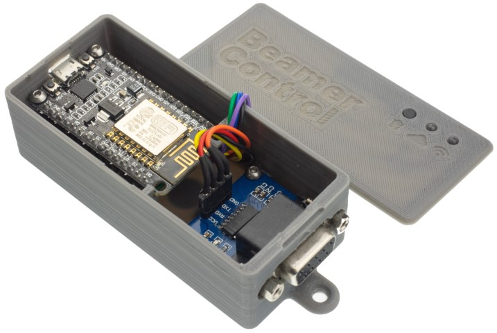
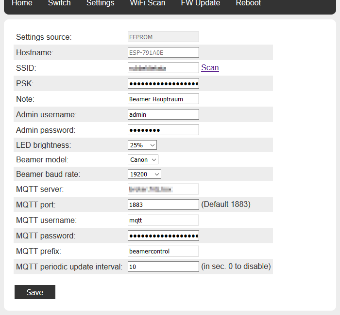
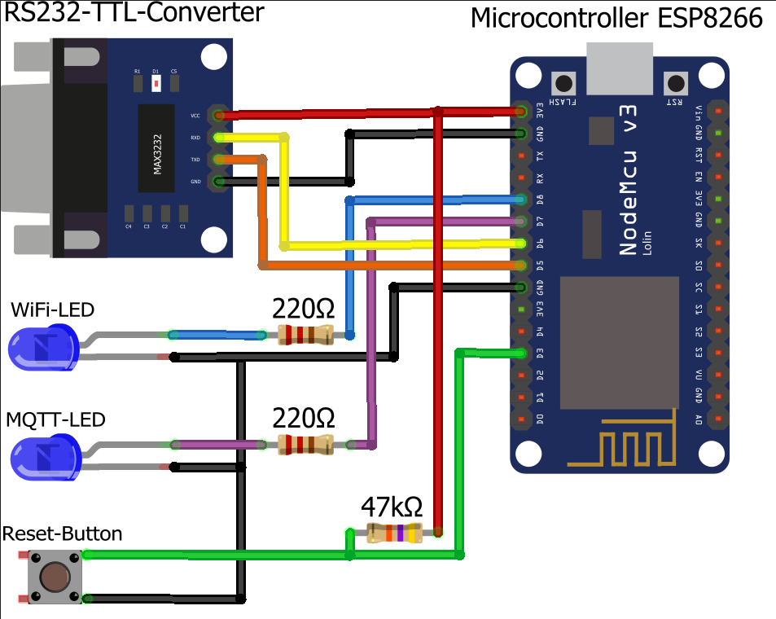
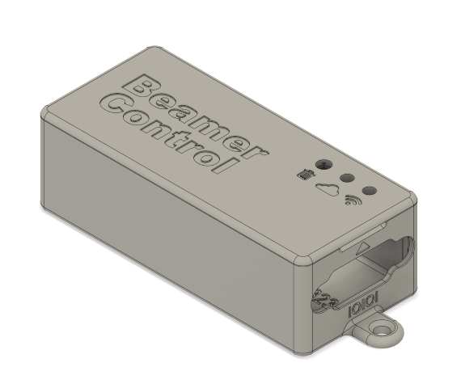
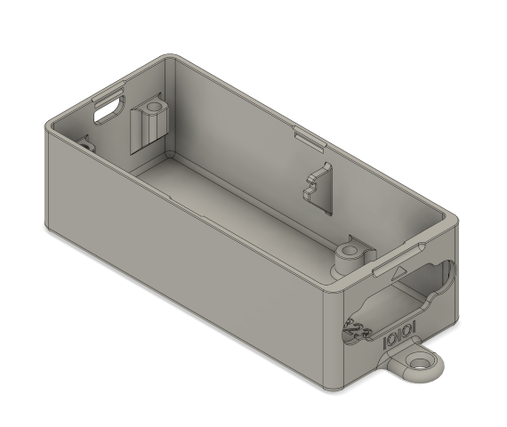

# BeamerControl

A Arduino/ESP8266/NodeMCU based RS232-MQTT-Bridge to control a projector (german: Beamer) via the RS232 serviceport.

## Supported Projectors

- Canon LV-Series (May need a proprietary DB9-Adapter-Cable)
- Many BenQ-Models, the following Models are known to work:
	- BenQ LX770/LH770
	- BenQ TH681
	- BenQ TH530

## Wiring

## Case

You can find a case for 3D-Printing on [Printables](https://www.printables.com/model/465783-beamercontrol-rs232-mqtt-bridge-to-control-a-beame).  
This case is intended to be used with an original NodeMCU and a generic TTL-to-RS232 adapter.

## Installation
This software was created using Visual Studio Code in combination with PlatformIO.  

Its easiest to use these same tools to flash this software to your own ESP-Board.  
For this to work, you need to have VSCode with PlatformIO installed.  

In order to install BeamerControl on your ESP8266, you just need to clone this repo (this can be done in the Homescreen in VSCode), then clicking the "Alien"-icon (PlatformIO) on the left, while you are in the folder with the file *platformio.ini* and the select *Upload*. The correct serial-port of your board should be obtained automatically.  

### Usage
After you flashed image, a new wifi "BeamerControl" is opened.
If you connect to this, open the webinterface on `192.168.4.1` and then click `WiFi Scan` to connect BeamerControl to your own WiFi. When you are asked for a password, type in `admin/admin`. Then set the Model and Baudrate to match the Baudrate set in your Projectors menu. All other settings are pretty self explanatory.  

To reset all settings, press the Reset-Button for at least 30 seconds.

## REST API

In order to use the REST-API you have to authenticate with the user and password set in the settings-menu (default: `api/api`)  
The following calls are available:
- `http://api:api@[hostname]/api/on`  
- `http://api:api@[hostname]/api/off`  

They respond the status-code 200 upon success with either *on* or *off* accordingly.

## MQTT Topics

### Status updates

The device send JSON-formatted status message periodically (can be changed), by request (see command section) or the power state is changes with the button or on webinterface on the following topics:

- `<prefix>/<hostname>/status`

### Commands

The device support a set of commands published on

- `<prefix>/<hostname>/cmd`
- `<prefix>/cmd`

| Command             | Description                          |
| ------------------- | ------------------------------------ |
| `{"poweron":true}`  | Power on Projector                   |
| `{"poweron":false}` | Shutdown Projector                   |
| `{"pwrstate":"on"}` | Power on Projector                   |
| `{"poweron":"off"}` | Shutdown Projector                   |
| `{"status":"get"}`  | Triggers status push on status topic |
